# Project 0 
### balkon16
### Course: Web Programming with Python and JavaScript

 
The following README file presents minumum requirements for the project.  

1. At least one list 

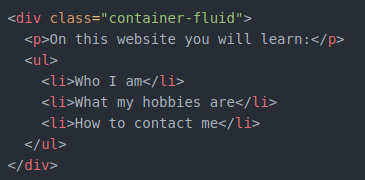

2. At least one table 

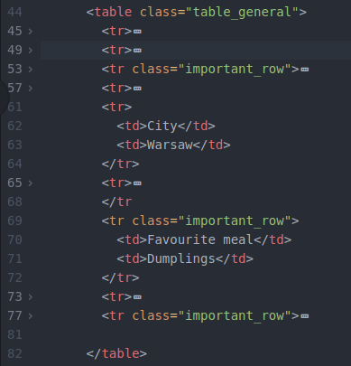

3. At least one image 

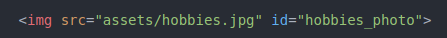

4. At least one CSS stylesheet 

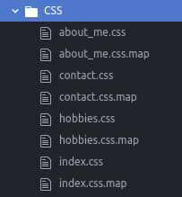

5. At least five CSS properties 

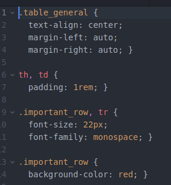

6. At least five CSS selectors 

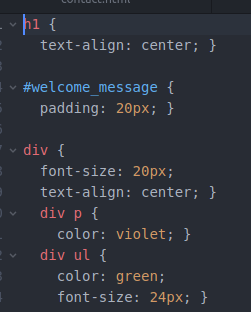

7. At least one \#id selector 

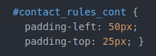

8. At least one .class selector 

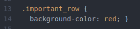

9. At least one @media query 

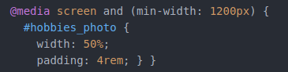

10. At least one Bootstrap component 

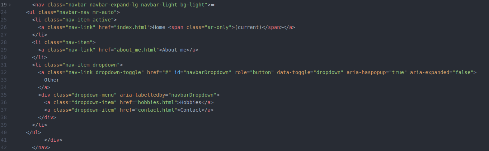

11. At least two Bootstrap columns 

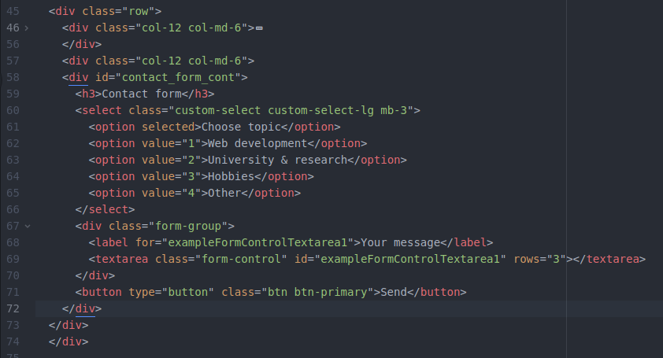

12. At least one SASS variable 

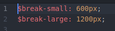

13. At least one SASS nesting 

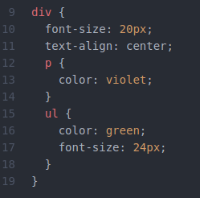

14. At least one SASS inheritance 

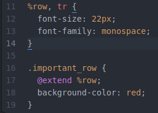
